# VM vs Container Performance Comparison


---

## 1. Project Overview

This project compares the performance of an **Ubuntu Virtual Machine (VM)** and a **Docker Container** running the same FastAPI-based workloads.

The experiment evaluates:

* Compute performance
* Memory performance
* Concurrent request handling
* Docker CPU usage
* Docker memory usage
* System memory usage
* API response time
* Docker networking configuration

The purpose of the experiment is to understand the performance characteristics of a traditional Virtual Machine compared with a lightweight containerized environment.

---

## 2. Objectives

The main objectives of this experiment are:

* To compare VM and Docker application performance.
* To measure compute execution time.
* To measure memory operation time.
* To test concurrent API requests.
* To observe Docker resource consumption.
* To compare response times between VM and Docker.
* To understand the basic networking configuration of VM and Docker.
* To visualize the experimental results using graphs.

---

## 3. VM vs Docker

### Virtual Machine

A Virtual Machine runs a complete guest operating system on virtualized hardware.

```text
Application
     ↓
Guest Operating System
     ↓
Virtual Hardware
     ↓
Hypervisor
     ↓
Host Operating System
     ↓
Physical Hardware
```

### Docker Container

A Docker container isolates an application while sharing the host operating system kernel.

```text
Application
     ↓
Docker Container
     ↓
Host Operating System Kernel
     ↓
Physical Hardware
```

Because containers share the host kernel, they generally have less virtualization overhead than a complete Virtual Machine.

---

## 4. Experimental Environment

### Virtual Machine

* Operating System: Ubuntu 24.04
* Environment: VMware Virtual Machine
* Native VM API: `http://localhost:8000`

### Docker

* Container Technology: Docker
* Docker API: `http://localhost:8001`
* Containerized FastAPI application

### Tools Used

* Ubuntu Linux
* Docker
* Python
* FastAPI
* Uvicorn
* ApacheBench
* Linux system monitoring tools
* Git/GitHub

---

## 5. Experimental Methodology

The experiment was performed by running equivalent application workloads in the VM and Docker environments.

The following tests were performed:

1. Compute test
2. Memory test
3. Concurrent request test
4. Docker resource monitoring
5. System memory monitoring
6. Docker networking verification

The measured values were recorded and converted into graphs for easier comparison.

---

# 6. Compute Performance Test

The compute test measures the time required to execute the compute workload.

Lower execution time indicates better performance.

### Results

| Metric  |  Native VM |     Docker |
| ------- | ---------: | ---------: |
| Average | 0.039293 s | 0.052390 s |
| Minimum | 0.035845 s | 0.049004 s |
| Maximum | 0.053111 s | 0.061435 s |

### Compute Performance Graph

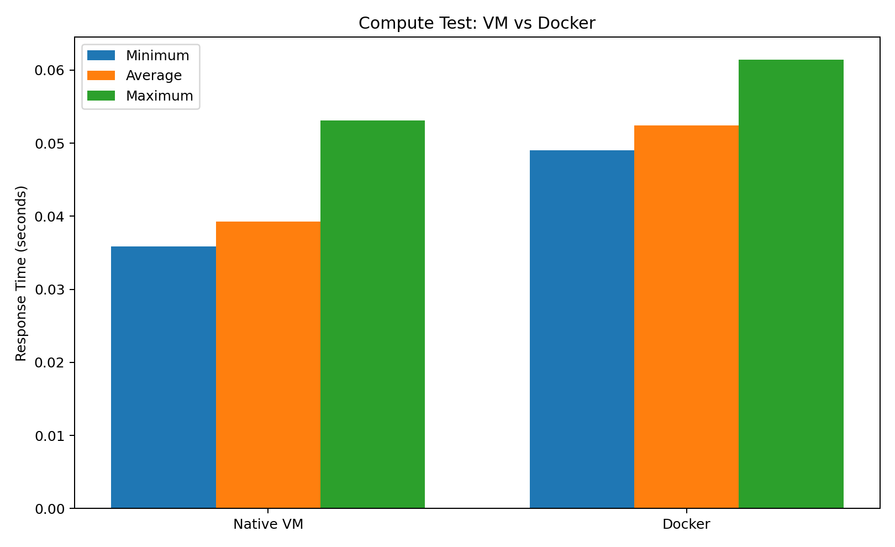

### Analysis

The Native VM recorded lower average, minimum, and maximum execution times compared with Docker for the tested compute workload.

The average execution time was:

* **VM:** 0.039293 seconds
* **Docker:** 0.052390 seconds

Therefore, the VM completed this particular compute workload faster in the experiment.

---

# 7. Memory Performance Test

The memory test measures the execution time of the memory workload.

Lower execution time indicates better performance.

### Results

| Metric  |  Native VM |     Docker |
| ------- | ---------: | ---------: |
| Average | 0.031218 s | 0.034857 s |
| Minimum | 0.028431 s | 0.031907 s |
| Maximum | 0.041243 s | 0.043938 s |

### Memory Performance Graph

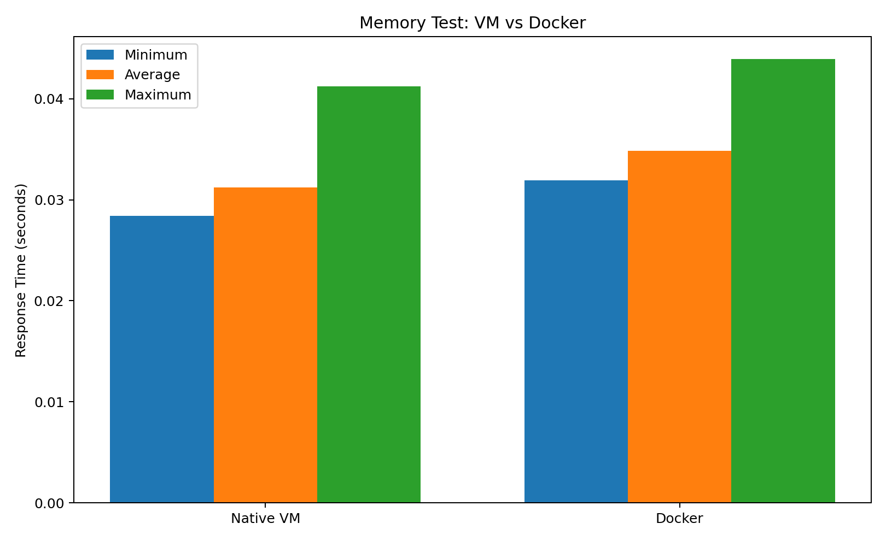

### Analysis

The Native VM recorded slightly lower memory execution times for all three measured values.

The average memory execution time was:

* **VM:** 0.031218 seconds
* **Docker:** 0.034857 seconds

The difference is relatively small compared with the compute test.

---

# 8. Concurrent Request Test

The concurrent request test evaluates how the VM and Docker environments handle multiple requests at the same time.

### Test Configuration

```text
Total Requests: 100
Concurrency: 10
```

### Results

| Metric          | Native VM | Docker |
| --------------- | --------: | -----: |
| Requests        |       100 |    100 |
| Concurrency     |        10 |     10 |
| Failed Requests |         0 |      0 |

### Concurrent Request Graph

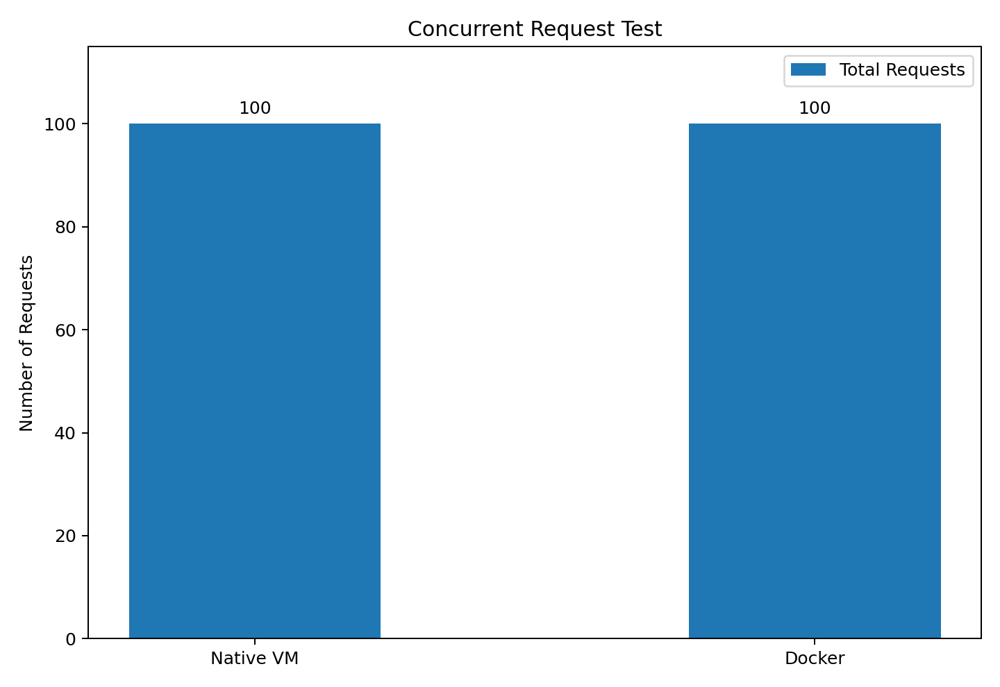

### Additional Visualization

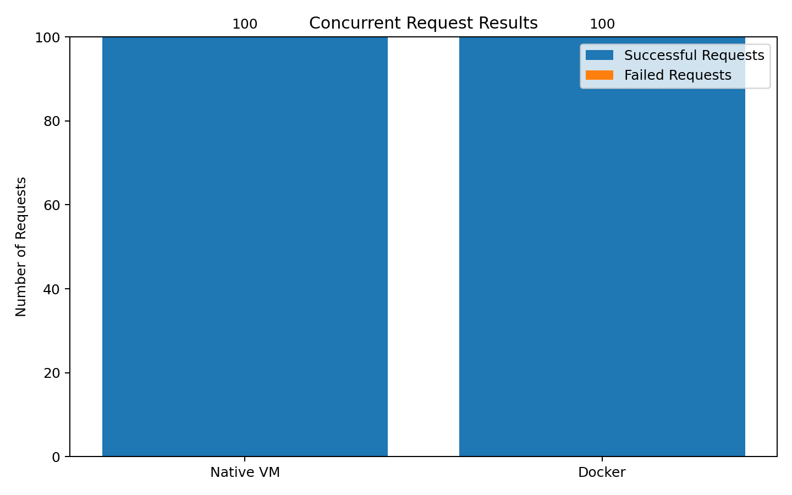

### Analysis

Both environments successfully processed all 100 requests with a concurrency level of 10.

```text
Native VM → 100 requests → 0 failures
Docker    → 100 requests → 0 failures
```

Therefore, both environments successfully handled the tested concurrent workload.

---

# 9. Docker Resource Usage

Docker resource consumption was monitored while the application was running.

### Recorded Values

| Resource |            Docker Usage |
| -------- | ----------------------: |
| CPU      |     Approximately 0.24% |
| Memory   | Approximately 111.9 MiB |

### Docker CPU Usage

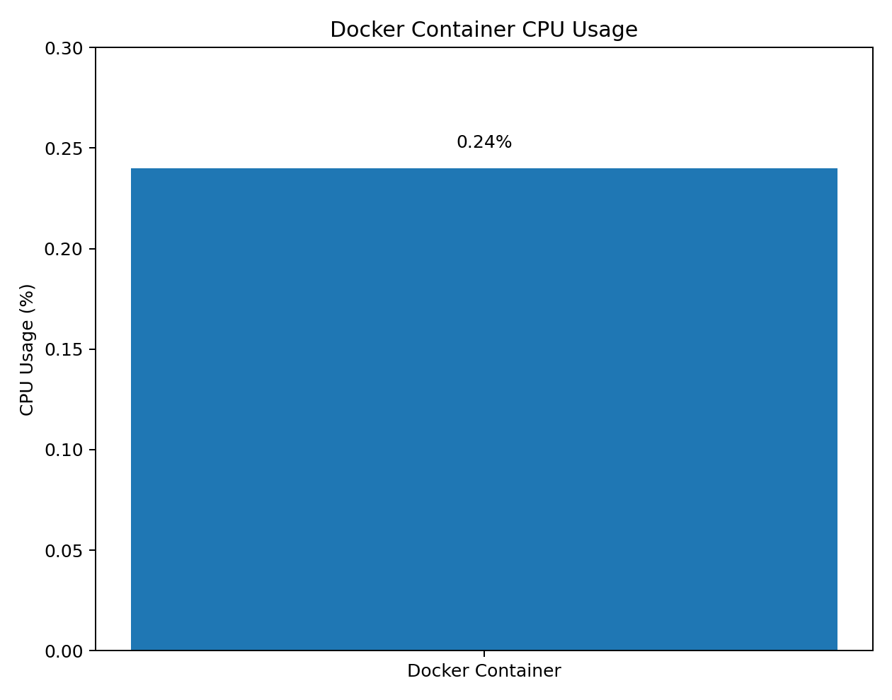

### Detailed Docker CPU Usage

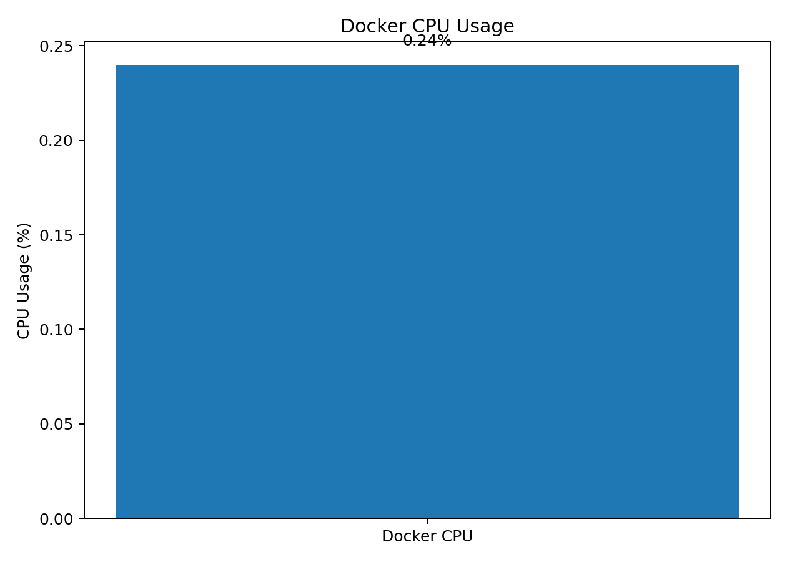

### Docker Memory Usage

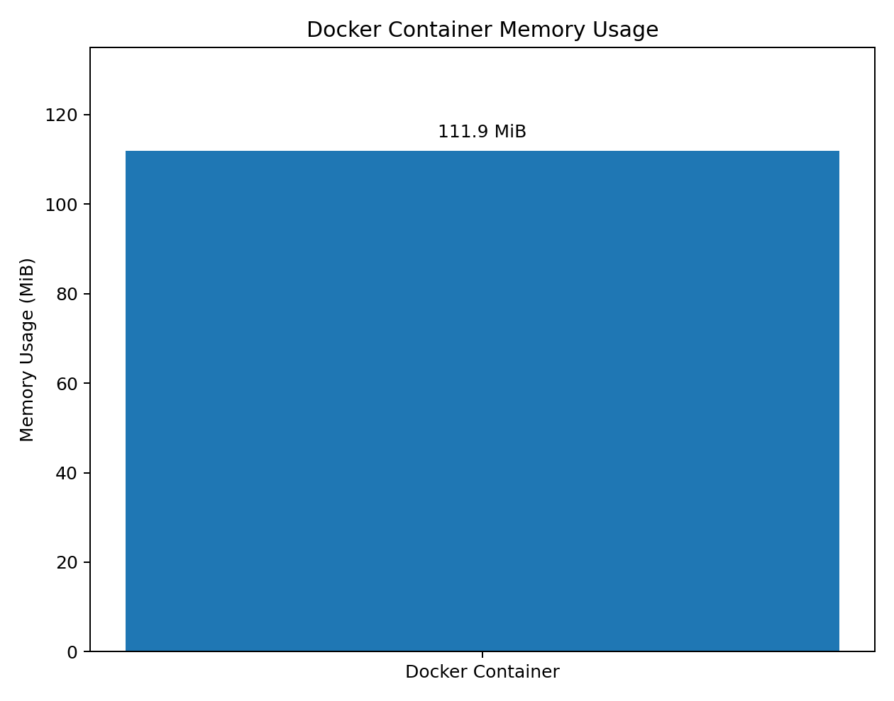

### Detailed Docker Memory Usage

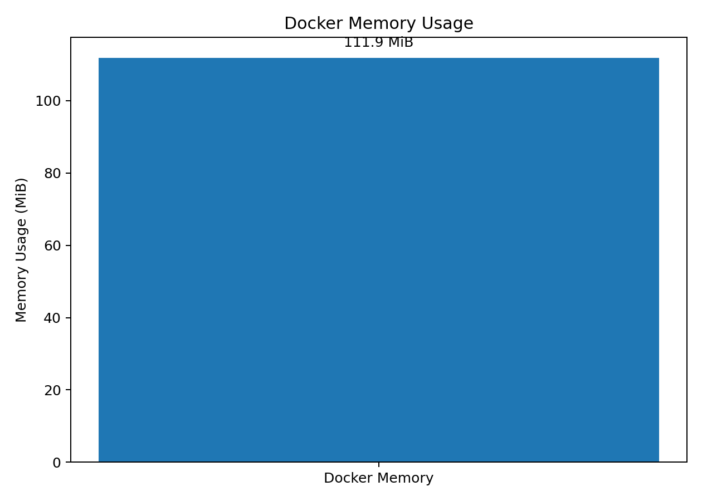

### Analysis

The Docker container used approximately:

* **0.24% CPU**
* **111.9 MiB memory**

during the recorded resource observation.

These measurements demonstrate the relatively small resource footprint of the tested container workload.

---

# 10. System Memory

The system memory was checked using Linux memory monitoring tools.

### Results

| Memory Metric |   Value |
| ------------- | ------: |
| Total RAM     | 8.1 GiB |
| Used          | 1.7 GiB |
| Free          | 4.2 GiB |
| Available     | 6.3 GiB |

### System Memory Graph

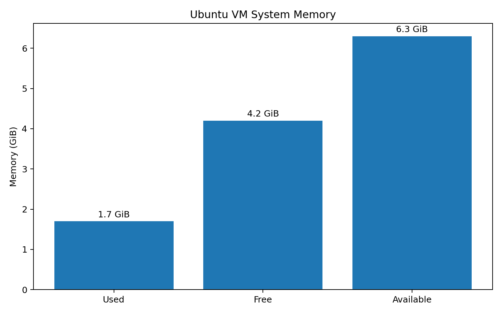

### Analysis

The system had a total memory capacity of **8.1 GiB**.

At the time of measurement:

* 1.7 GiB was used.
* 4.2 GiB was free.
* 6.3 GiB was available.

The available memory indicates that sufficient system memory was available during the experiment.

---

# 11. Overall Response Time

The compute and memory response-time measurements can be compared to understand the overall difference between the Native VM and Docker environments.

### Response Time Results

| Workload | VM Average | Docker Average |
| -------- | ---------: | -------------: |
| Compute  | 0.039293 s |     0.052390 s |
| Memory   | 0.031218 s |     0.034857 s |

### Overall Response Time Graph

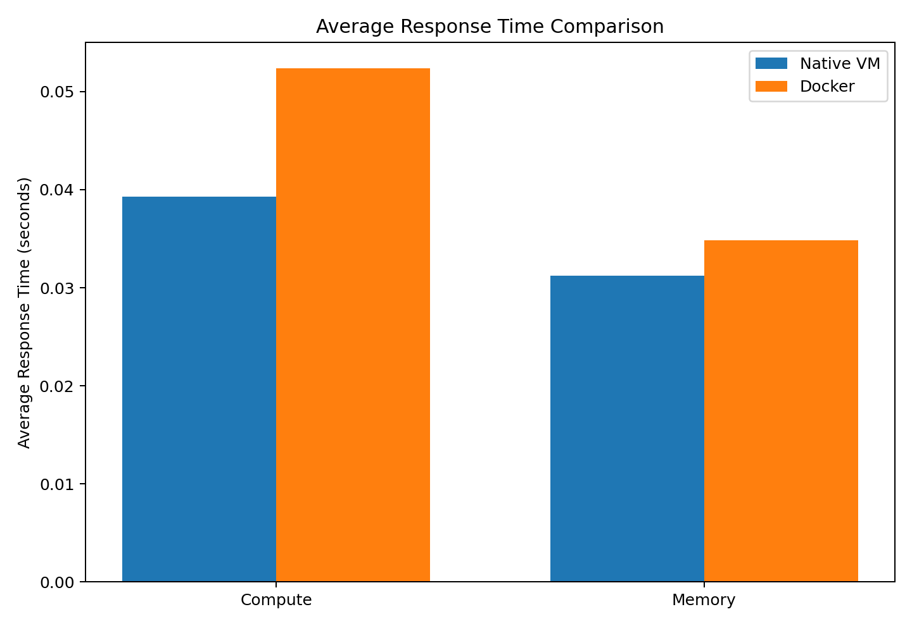

### Average Response Time by Workload

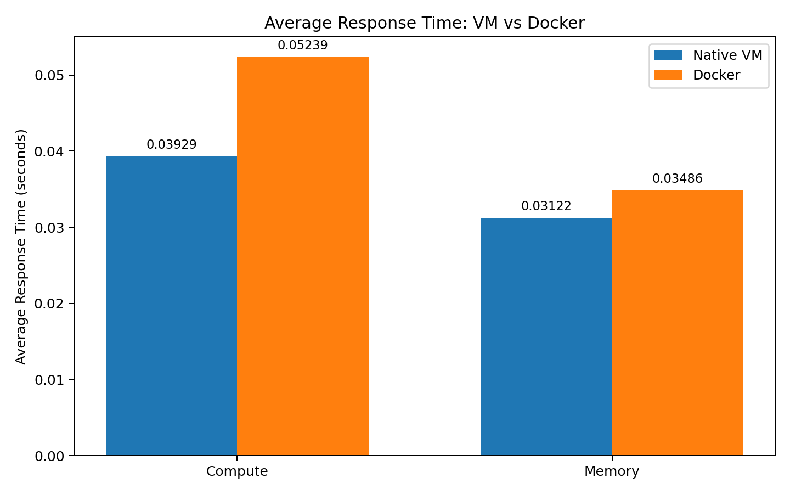

### Analysis

For both tested workloads, the Native VM recorded a lower average response time than Docker.

The difference was more noticeable for the compute workload than for the memory workload.

---

# 12. Docker Networking

The experiment used separate ports for the Native VM API and Docker API.

### Network Configuration

| Environment | API Port |
| ----------- | -------: |
| Native VM   |     8000 |
| Docker      |     8001 |

### API Endpoints

```text
Native VM API
http://localhost:8000

Docker API
http://localhost:8001
```

The separate ports allowed the two environments to be tested independently.

---

# 13. Performance Comparison

The main measured values are summarized below.

| Metric              |  Native VM |     Docker |
| ------------------- | ---------: | ---------: |
| Compute Average     | 0.039293 s | 0.052390 s |
| Compute Minimum     | 0.035845 s | 0.049004 s |
| Compute Maximum     | 0.053111 s | 0.061435 s |
| Memory Average      | 0.031218 s | 0.034857 s |
| Memory Minimum      | 0.028431 s | 0.031907 s |
| Memory Maximum      | 0.041243 s | 0.043938 s |
| Concurrent Requests |        100 |        100 |
| Concurrency         |         10 |         10 |
| Failed Requests     |          0 |          0 |

---

# 14. Overall Analysis

### Compute

The Native VM achieved a lower average compute execution time than Docker.

```text
VM     : 0.039293 s
Docker : 0.052390 s
```

### Memory

The Native VM also recorded a lower average memory execution time.

```text
VM     : 0.031218 s
Docker : 0.034857 s
```

### Concurrent Requests

Both environments successfully handled:

```text
100 requests
10 concurrent requests
0 failed requests
```

### Docker Resources

The Docker container used approximately:

```text
CPU    : 0.24%
Memory : 111.9 MiB
```

### Overall

The experiment demonstrates that the performance difference between a VM and Docker depends on the workload being tested.

For the workloads measured in this experiment, the Native VM recorded lower response times, while Docker successfully handled the tested concurrent workload with zero failures and a relatively small observed resource footprint.

---

# 15. Graphs and Experimental Evidence

All graphs generated from the measured values are stored in the `Figures` directory.

```text
Figures/
│
├── compute_performance.png
├── memory_performance.png
├── concurrent_requests.png
├── concurrent_request_results.png
│
├── docker_cpu_usage.png
├── docker_cpu_usage_detailed.png
│
├── docker_memory_usage.png
├── docker_memory_usage_detailed.png
│
├── system_memory.png
│
├── overall_response_time.png
└── average_response_time_by_workload.png
```

The graphs provide visual representations of the measured experimental results.

---

# 16. Project Structure

```text
VM-vs-Container-Performance/
│
├── api/
│   ├── app.py
│   ├── Dockerfile
│   └── requirements.txt
│
├── docker/
│   └── Dockerfile
│
├── docs/
│   └── documentation files
│
├── results/
│   └── benchmark results
│
├── screenshots/
│   └── experimental screenshots
│
├── Figures/
│   ├── compute_performance.png
│   ├── memory_performance.png
│   ├── concurrent_requests.png
│   ├── concurrent_request_results.png
│   ├── docker_cpu_usage.png
│   ├── docker_cpu_usage_detailed.png
│   ├── docker_memory_usage.png
│   ├── docker_memory_usage_detailed.png
│   ├── system_memory.png
│   ├── overall_response_time.png
│   └── average_response_time_by_workload.png
│
├── scripts/
│   └── benchmark scripts
│
├── README.md
└── .gitignore
```

---

# 17. Conclusion

This experiment compared a Virtual Machine and a Docker Container using compute, memory, concurrent request, resource usage, and networking tests.

The measured results showed that the Native VM achieved lower execution times for both the compute and memory workloads tested.

Docker successfully processed the concurrent request workload with zero failed requests and demonstrated a low observed resource footprint.

The experiment provides practical insight into the performance characteristics of Virtual Machines and Docker containers and demonstrates how benchmark results can be measured, recorded, and visualized.

---

## Repository

This project contains the source code, Docker configuration, benchmark results, screenshots, and graphs required to reproduce and understand the experiment.

**VM vs Container Performance Comparison — Experimental Benchmark**
