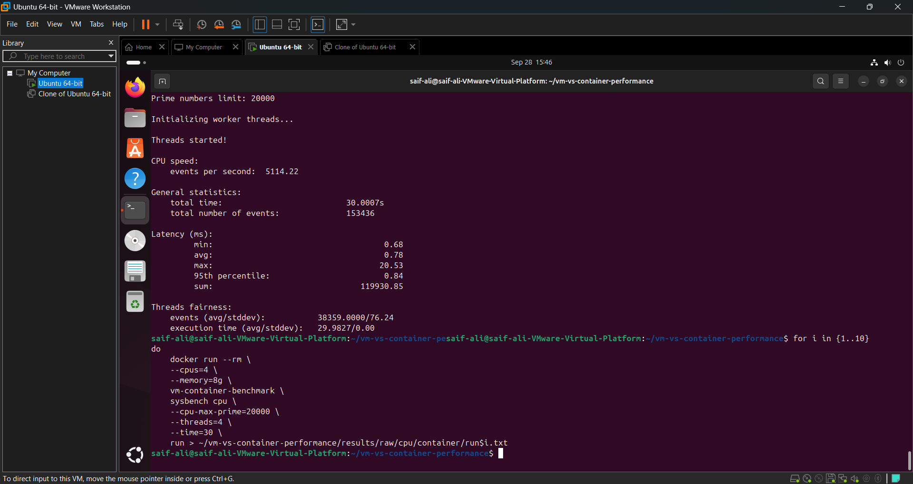
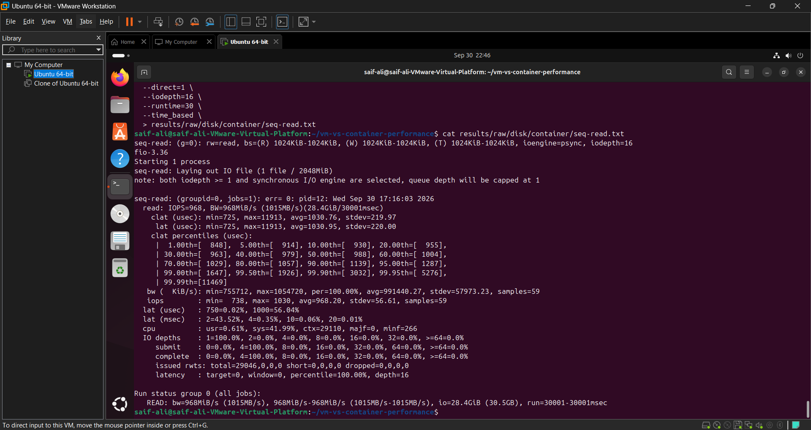
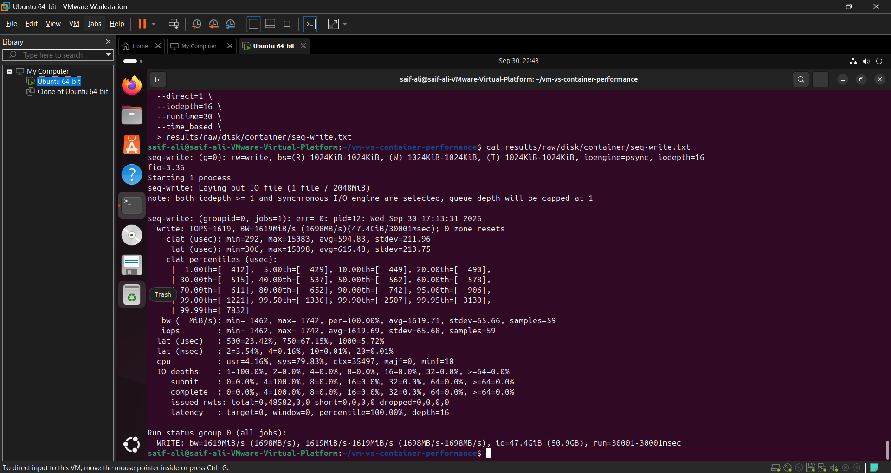
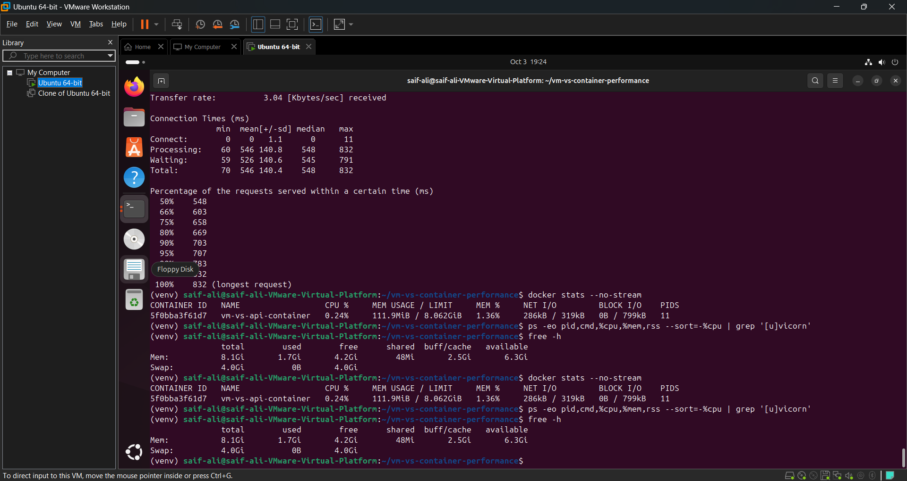
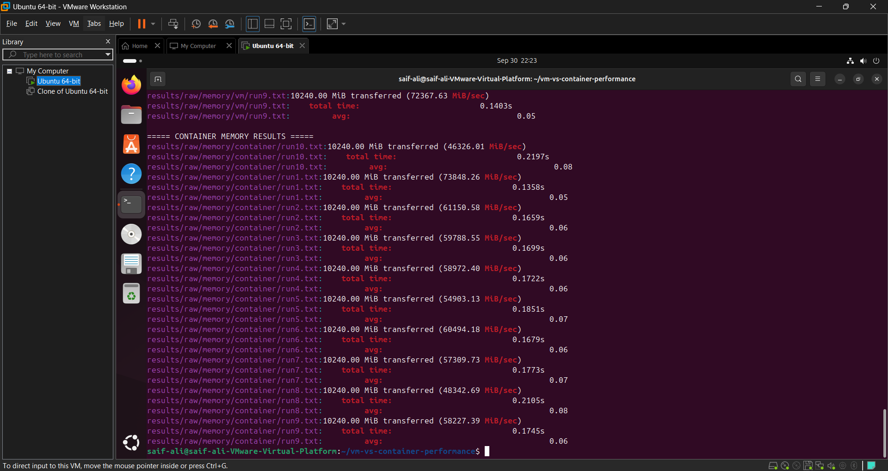
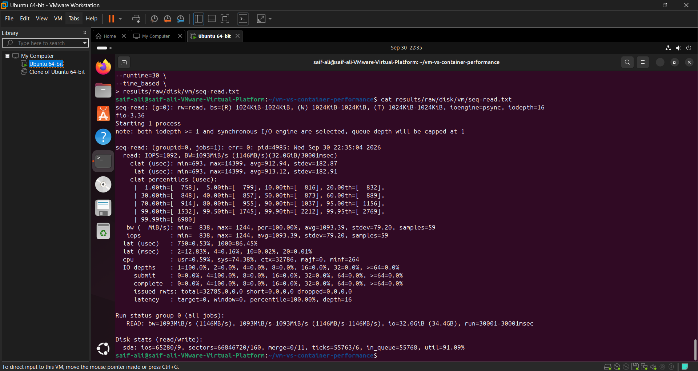
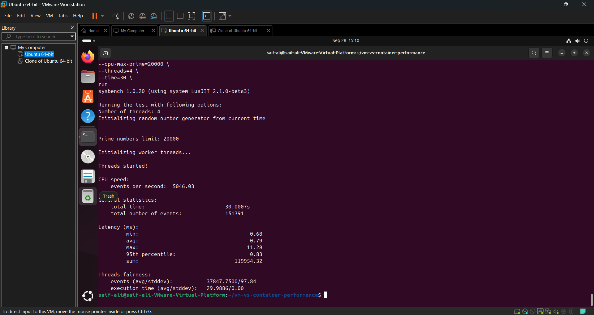

# VM vs Container Performance Analysis


---

## 1. Project Overview

This project evaluates the performance differences between a **Virtual Machine (VM)** and a **Docker Container**.

The experiment was conducted inside an **Ubuntu 24.04 virtual machine running on VMware**. A FastAPI application was deployed in two environments:

1. **Native VM environment**
2. **Docker container environment**

The two environments were compared using compute performance, memory performance, concurrent request handling, and Docker resource usage.

The objective is to understand the performance characteristics and resource overhead of containerized applications compared with applications running directly inside a virtual machine.

---

## 2. Objectives

The main objectives of this experiment are:

* Compare compute performance between a VM and Docker container.
* Compare memory-related application performance.
* Test concurrent request handling.
* Measure Docker CPU utilization.
* Measure Docker memory consumption.
* Compare response times between the two environments.
* Understand the practical performance differences between VMs and containers.

---

# 3. VM vs Container

## Virtual Machine

A Virtual Machine runs a complete guest operating system on virtualized hardware.

```text
Application
     ↓
Guest Operating System
     ↓
Virtual Hardware
     ↓
Hypervisor
     ↓
Host Operating System
     ↓
Physical Hardware
```

In this project, Ubuntu 24.04 is running as a virtual machine using VMware.

## Docker Container

A Docker container isolates an application while sharing the operating system kernel.

```text
Application
     ↓
Docker Container
     ↓
Host OS Kernel
     ↓
Physical / Virtual Hardware
```

Containers generally have lower operating-system overhead because they do not require a complete guest operating system for every application.

---

# 4. Experimental Environment

## VM Environment

| Parameter        | Configuration          |
| ---------------- | ---------------------- |
| Virtualization   | VMware Virtual Machine |
| Operating System | Ubuntu 24.04           |
| Environment      | Native VM              |
| Application      | FastAPI                |
| Native API Port  | `8000`                 |

## Docker Environment

| Parameter            | Configuration         |
| -------------------- | --------------------- |
| Container Technology | Docker                |
| Base Environment     | Ubuntu 24.04          |
| Application          | FastAPI               |
| Docker API Port      | `8001`                |
| Container            | `vm-vs-api-container` |

## System Memory

The Ubuntu VM reported the following memory information during the experiment:

| Memory Parameter |   Value |
| ---------------- | ------: |
| Total RAM        | 8.1 GiB |
| Used             | 1.7 GiB |
| Free             | 4.2 GiB |
| Available        | 6.3 GiB |
| Swap             | 4.0 GiB |

---

# 5. Technologies Used

* Ubuntu 24.04
* VMware
* Docker
* Python
* FastAPI
* Uvicorn
* ApacheBench
* Linux
* Shell scripting
* Git and GitHub
* Docker monitoring tools

---

# 6. Application Architecture

The same FastAPI application was used to perform the performance comparison.

```text
                         VM Environment
                              │
                    ┌─────────▼─────────┐
                    │   FastAPI App      │
                    │    Port 8000       │
                    └─────────┬─────────┘
                              │
                              │
                     Performance Tests
                              │
                              ▼
                    ┌───────────────────┐
                    │ Compute / Memory  │
                    │ Concurrent Tests  │
                    └───────────────────┘


                         Docker Environment
                              │
                    ┌─────────▼─────────┐
                    │ Docker Container   │
                    │   FastAPI App      │
                    │    Port 8001       │
                    └─────────┬─────────┘
                              │
                              │
                     Performance Tests
                              │
                              ▼
                    ┌───────────────────┐
                    │ Compute / Memory  │
                    │ Concurrent Tests  │
                    └───────────────────┘
```

---

# 7. Experimental Methodology

The experiment consisted of the following tests.

### Test 1 — Compute Performance

The FastAPI compute workload was executed in both environments.

The average, minimum, and maximum response times were recorded.

### Test 2 — Memory Performance

The memory workload was executed in both environments.

The average, minimum, and maximum execution times were recorded.

### Test 3 — Concurrent Requests

Both environments were tested with:

* Total requests: `100`
* Concurrency level: `10`

Failed requests were recorded.

### Test 4 — Docker Resource Usage

Docker resource consumption was monitored using:

```bash
docker stats
```

CPU and memory usage were recorded.

### Test 5 — System Memory

System memory was checked using:

```bash
free -h
```

### Test 6 — Network Configuration

The FastAPI services were exposed using:

```text
Native VM → Port 8000
Docker    → Port 8001
```

---

# 8. Compute Performance

The compute test measured the response time of the compute workload.

## Results

| Environment |    Average |    Minimum |    Maximum |
| ----------- | ---------: | ---------: | ---------: |
| Native VM   | 0.039293 s | 0.035845 s | 0.053111 s |
| Docker      | 0.052390 s | 0.049004 s | 0.061435 s |

### Compute Performance Graph


The graph compares the minimum, average, and maximum response times of the Native VM and Docker environments.

---

# 9. Memory Performance

The memory test measured the execution time of the memory workload.

## Results

| Environment |    Average |    Minimum |    Maximum |
| ----------- | ---------: | ---------: | ---------: |
| Native VM   | 0.031218 s | 0.028431 s | 0.041243 s |
| Docker      | 0.034857 s | 0.031907 s | 0.043938 s |

### Memory Performance Graph


The graph shows the minimum, average, and maximum memory-test execution times for both environments.

---

# 10. Concurrent Request Performance

The application was tested with 100 requests and a concurrency level of 10.

## Results

| Environment | Requests | Concurrency | Failed Requests |
| ----------- | -------: | ----------: | --------------: |
| Native VM   |      100 |          10 |               0 |
| Docker      |      100 |          10 |               0 |

### Concurrent Request Graph


Both environments successfully completed all 100 requests without failed requests during this test.

---

# 11. Docker Resource Usage

Docker resource usage was monitored using:

```bash
docker stats --no-stream
```

The recorded Docker container resource usage was approximately:

| Resource |     Usage |
| -------- | --------: |
| CPU      |     0.24% |
| Memory   | 111.9 MiB |

### Docker CPU Usage


### Docker Memory Usage


The measurements provide an indication of the resource consumption of the FastAPI Docker container during the experiment.

---

# 12. System Memory

The Ubuntu VM reported:

```text
Total RAM:       8.1 GiB
Used:            1.7 GiB
Free:            4.2 GiB
Available:       6.3 GiB
```

The system also had approximately:

```text
Swap: 4.0 GiB
```

This information provides the system-level memory context in which the benchmark was executed.

---

# 13. Docker Networking

The FastAPI application was exposed using separate ports for the two environments.

| Environment | Port |
| ----------- | ---: |
| Native VM   | 8000 |
| Docker      | 8001 |

```text
Native VM FastAPI
        │
        └── http://localhost:8000


Docker FastAPI
        │
        └── http://localhost:8001
```

This configuration allowed the two environments to be tested independently.

---

# 14. Overall Response-Time Comparison

The overall response-time graph summarizes the measured average response times for the compute and memory workloads.


The measured results show that the response times vary between the Native VM and Docker environments depending on the workload.

---

# 15. Performance Analysis

## Compute Performance

The Native VM recorded an average compute response time of:

```text
0.039293 seconds
```

Docker recorded:

```text
0.052390 seconds
```

The measured Docker response time was therefore higher for this particular compute test.

---

## Memory Performance

The Native VM recorded an average memory-test execution time of:

```text
0.031218 seconds
```

Docker recorded:

```text
0.034857 seconds
```

The difference was smaller than that observed in the compute test.

---

## Concurrent Requests

Both environments successfully processed:

```text
100 requests
10 concurrent requests
0 failed requests
```

This indicates that both implementations successfully handled the tested concurrent workload.

---

## Docker Resource Usage

The Docker container consumed approximately:

```text
CPU:    0.24%
Memory: 111.9 MiB
```

These values represent the resource usage observed during the monitoring period.

---

# 16. Overall Comparison

| Metric          |  Native VM |     Docker |
| --------------- | ---------: | ---------: |
| Compute Average | 0.039293 s | 0.052390 s |
| Compute Minimum | 0.035845 s | 0.049004 s |
| Compute Maximum | 0.053111 s | 0.061435 s |
| Memory Average  | 0.031218 s | 0.034857 s |
| Memory Minimum  | 0.028431 s | 0.031907 s |
| Memory Maximum  | 0.041243 s | 0.043938 s |
| Requests        |        100 |        100 |
| Concurrency     |         10 |         10 |
| Failed Requests |          0 |          0 |
| Docker CPU      |          — |     ~0.24% |
| Docker Memory   |          — | ~111.9 MiB |

---

# 17. Overall Performance Graph

The following graph provides a visual comparison of the measured response-time results.


The results demonstrate that the performance difference between VM and Docker depends on the workload being executed.

---

# 18. Experimental Evidence

The repository also contains screenshots captured during the experiment.

## Docker CPU Limits / Configuration



## Docker Disk Test





## Docker Resource Monitoring



## Docker Memory Benchmark



## VM Disk Test



## VM CPU Benchmark



These screenshots provide supporting evidence for the experimental setup and benchmark execution.

---

# 19. Graphs Generated from Experimental Results

The `Figures/` directory contains graphs generated from the measured benchmark values.

```text
Figures/
│
├── compute_performance.png
├── concurrent_requests.png
├── docker_cpu_usage.png
├── docker_memory_usage.png
├── memory_performance.png
└── overall_response_time.png
```

The graphs are visual representations of the actual benchmark values recorded during the experiment.

---

# 20. Project Structure

```text
VM-vs-Container-Performance/
│
├── api/
│   ├── Dockerfile
│   ├── main.py
│   └── requirements.txt
│
├── docker/
│   └── Dockerfile
│
├── docs/
│   ├── cpu-info.txt
│   ├── kernel-info.txt
│   ├── memory-info.txt
│   ├── storage-info.txt
│   └── vm-configuration.txt
│
├── results/
│   └── benchmark_results.txt
│
├── Figures/
│   ├── compute_performance.png
│   ├── concurrent_requests.png
│   ├── docker_cpu_usage.png
│   ├── docker_memory_usage.png
│   ├── memory_performance.png
│   └── overall_response_time.png
│
├── screenshots/
│   ├── docker-cpu-limits-command.png
│   ├── docker-fio-sequential-read.png
│   ├── docker-fio-sequential-write.png
│   ├── fastapi-docker-resource-snapshot.png
│   ├── sysbench-memory-runs-summary.png
│   ├── vm-fio-sequential-read.png
│   └── vm-sysbench-cpu-run.png
│
├── scripts/
│   └── benchmark_summary.sh
│
├── .gitignore
└── README.md
```

---

# 21. Advantages of Containers

Containers provide several practical advantages:

* Lightweight deployment
* Fast application startup
* Efficient resource utilization
* Easy application packaging
* Reproducible environments
* Convenient deployment using Docker images
* Multiple isolated applications can share the same host kernel

---

# 22. Advantages of Virtual Machines

Virtual machines provide:

* Complete guest operating systems
* Strong isolation
* Ability to run different operating systems
* Virtualized hardware environments
* Useful infrastructure-level virtualization
* Mature virtualization platforms

---

# 23. VM vs Docker Comparison

| Feature             | Virtual Machine       | Docker Container   |
| ------------------- | --------------------- | ------------------ |
| Virtualization      | Hardware-level        | OS-level           |
| Guest OS            | Required              | Not required       |
| Kernel              | Separate guest kernel | Shared host kernel |
| Resource overhead   | Generally higher      | Generally lower    |
| Startup             | Generally slower      | Generally faster   |
| Isolation           | Strong                | Lightweight        |
| Portability         | High                  | High               |
| Resource efficiency | Lower                 | Higher             |

The actual benchmark results, rather than theoretical expectations alone, should be used when evaluating performance for a particular workload.

---

# 24. Conclusion

This experiment compared the performance of a FastAPI application running in a Native Ubuntu VM environment and a Docker container environment.

The experiment measured:

* Compute response time
* Memory-test response time
* Concurrent request handling
* Docker CPU usage
* Docker memory usage
* System memory
* Application networking

The benchmark results show measurable differences between the two environments.

For the tested workloads, the Native VM and Docker container both successfully handled the concurrent request test with **zero failed requests**. The compute and memory measurements showed differences in response time, while Docker resource monitoring showed approximately **0.24% CPU usage and 111.9 MiB memory usage** during the recorded observation.

The experiment demonstrates that VM and container performance can vary depending on the workload, resource configuration, virtualization environment, and application being tested.

---

# 25. Repository Contents

This repository contains:

* FastAPI application code
* Docker configuration
* VM configuration information
* Benchmark scripts
* Experimental results
* Graphs
* Screenshots
* Documentation
* Performance analysis

The project therefore provides both the **implementation and experimental evidence** for the VM vs Docker performance comparison.
